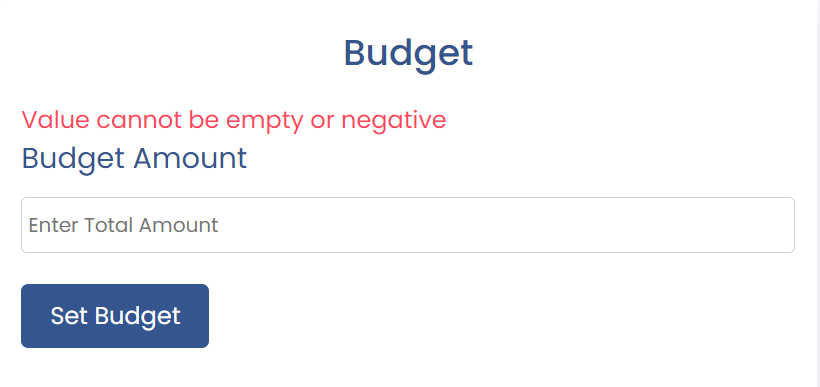
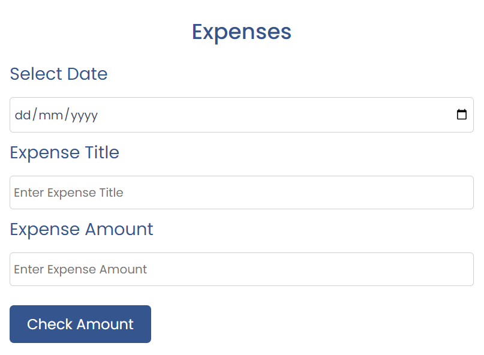

# Budget Tracker

The Budget Tracker site is created for tracking expense according to your budget.As soon as the user sets the budget or adds an expense, this site display an output that shows the budget, total expenses, and the balance left.

Following this output, I display a list of all the expenses which icludes expense  Date,titel and amount.this list of items also inculdes option to either edit or delete the list.

Budget Tracking is a fully responsive site.

## Picture of the website in different devices

Visit the deployed site: [Budget Tracker](https://shazi-dani.github.io/budget-tracker/)

## User Experience (UX)

### User Stories

* As a user, I want to be able to understand how to use the site without having to read instructions.
* As a user, I want to be able to set budget ,create expense list and balance left.

- - -

### Features

Budget Tracker is comprised of one page which holds the budget section, expense section ,output section and expense list section.

## Picture of the Budget Section

In Budget section you can add your budget amount and when you click on set budget button it will start showing in output section under budget heading. baudget value must be positive if you click on button without adding anything or add negtive value will get an error message.
## Picture of the Budget Section error

## Picture of the Expense Section

In Expense section you have to choose date of the expense, expense name and expense value and when you click on the check amount button then it will create a expense list in the expense list section and also shows expense value in output section and calculate how much balance left after that expense in your budget.
if you click on button and if any field is empty you will get an error message.
## Picture of the Expense Section error

## Picture of the Output Section

Output section shows budget value , expense value and also shows balance left value after calculating.

## Picture of the Expense List Section

this section display a list of all the expenses created by java script which icludes expense  Date,expense titel and amount.this list of items also inculdes option to either edit or delete the list.

### Accessibility

I have been mindful during coding to ensure that the website is as accessible friendly as possible. This has been have achieved by:

* Using semantic HTML.
* Ensuring that there is a sufficient colour contrast throughout the site.
* Check Accessibility of the site through lighthouse testing.First time its only 74%. 

Then update html and css code according the suggestions given by lighthouse testing and make it 100%.

### Future Implementations

* Add income section and income list in future.
* Add graphical representation of income,budget,expense and balance.

- - -

## Technologies Used

### Languages Used

HTML, CSS, JavaScript

### Frameworks, Libraries & Programs Used

[Github](https://github.com/) - To save and store the files for the website.

[GitPod](https://www.gitpod.io/) - IDE

[Google Fonts](https://fonts.google.com/) - To import the fonts used on the website.

[Font Awesome](https://fontawesome.com/) - For the iconography on the website.

[Google Developer Tools](https://developer.chrome.com/docs/devtools/) - To troubleshoot and test features, solve issues with responsiveness and styling.

[Am I Responsive?](http://ami.responsivedesign.is/) To show the website image on a range of devices.

- - -

## Deployment & Local Development

### Deployment

The site is deployed using GitHub Pages. To Deploy the site using GitHub Pages:

1. Login (or signup) to Github.
2. Go to the repository for this project, [Shazi-dani/budget-tracker](https://shazi-dani.github.io/budget-tracker/)
3. Click the settings button.
4. Select pages in the left hand navigation menu.
5. From the source dropdown select main branch and press save.
6. The site has now been deployed, please note that this process may take a few minutes before the site goes live.

### Local Development

#### How to Fork

To fork the Budget-Tracker repository:

1. Log in (or sign up) to Github.
2. Go to the repository for this project, [Shazi-dani/budget-tracker](https://shazi-dani.github.io/budget-tracker/)
3. Click the Fork button in the top right corner.

#### How to Clone

To clone the empowered repository:

1. Log in (or sign up) to GitHub.
2. Go to the repository for this project, [Shazi-dani/budget-tracker](https://shazi-dani.github.io/budget-tracker/)
3. Click on the code button, select whether you would like to clone with HTTPS, SSH or GitHub CLI and copy the link shown.
4. Open the terminal in your code editor and change the current working directory to the location you want to use for the cloned directory.
5. Type 'git clone' into the terminal and then paste the link you copied in step 3. Press enter.

- - -

## Testing

Testing was ongoing throughout the entire build. I utilised Chrome developer tools while building to pinpoint and troubleshoot any issues as I went along.

### W3C Validator

The W3C validator was used to validate the HTML. It was also used to validate CSS in the style.css file. Both files passed validation with no errors.

* [index.html](https://validator.w3.org/nu/?doc=https%3A%2F%2Fshazi-dani.githubio%2Fbudget-tracker%2F)
* [style.css](https://jigsaw.w3.org/css-validator/validator?uri=https%3A%2F%2F8000-shazidani-budgettracker-kf85puz222k.ws-eu102.gitpod.io%2F&profile=css3svg&usermedium=all&warning=1&vextwarning=&lang=en)

### Jshint JavaScript Validator

 - No errors were found when passing through the official [Jshint validator](https://jshint.com/)
 - The following metrics were returned: 

* there are 8 functions in this file.

* Function with the largest signature take 3 arguments, while the median is 0.5.

* Largest function has 15 statements in it, while the median is 4.5.

* The most complex function has a cyclomatic complexity value of 4 while the median is 1.

### Lighthouse

I used Lighthouse within the Chrome Developer Tools to allow me to test the performance, accessibility, best practices and SEO of the website.

- - -
## Credits

* Code Institute without who I would have had no base to begin a project & Readme.md Template. https://codeinstitute.net/ie/

* GitHub for my workspace and saving all my work as well as my deployed project . https://github.com/

* Gitpod for my coding. https://app.codeanywhere.com/

* The Slack community - for someone always been there no matter the time and with advice or direction. https://slack.com

* Google Fonts for my font choose for the project. https://fonts.google.com

* StackOverflow for all the information to assit with my project .https://stackoverflow.com

* W3C Validators both HTML and CSS to keep a check on my code. The W3C Markup Validation Service https://validator.w3.org

* I am Responsive for a fantastic spot to see a visual of responsiveness . https://ui.dev/amiresponsive?url=https://8000-shazidani-gponline-9wlpxvh7fwf.ws-eu99.gitpod.io

* Lighthouse testing system.

* Jshint JavaScript Validator [Jshint validator](https://jshint.com/)

* The delete and edit icons in the footer were taken from [Font Awesome](https://fontawesome.com/)

* Youtube Tutorials For getting ideas and inspiration for the site.Instructions on how to implement java script validation and list creating with java script. [Specific YouTube Tutorial](https://www.youtube.com/watch?v=i1pxPSl9ZHc)

Copied Code / Code assistance As stated in Technologies / Support Used I used and sort out help and code from numerous sources as well as fonts and images. Stack over flow and Tutor Support played a huge roll in my overall development.